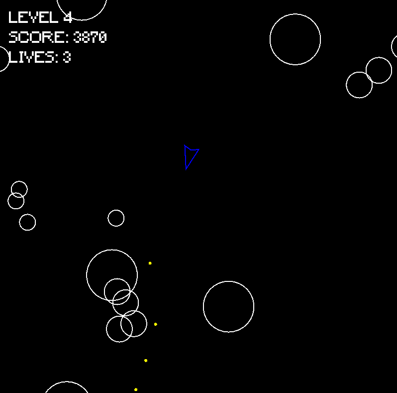

# 1. Introduction

A small Asteroids-style game written in C++ using SFML.
<p align="left">
  
</p>

---

# 2. Requirements

- C++ compiler (g++ recommended)
- `make`
- SFML 2.6.x
  - This project uses a vendored SFML setup: you download SFML for your operating system and place it into the correct folder under `vendor/sfml/`.
  - No Makefile edits are required.

---

# 3. Project Structure

    space-shooter/
    ├── src/
    ├── include/
    ├── assets/
    ├── vendor/
    │   └── sfml/
    │       ├── windows-mingw64/
    │       ├── linux-x86_64/
    │       ├── macos-x86_64/
    │       └── macos-arm64/
    └── Makefile

---

# 4. Installing SFML

SFML is downloaded manually and placed inside the vendor/sfml/ directory.  
No Makefile edits are required.

Download SFML 2.6.x from:
https://www.sfml-dev.org/download.php

Choose the build that matches your operating system:

- Windows: GCC / MinGW (SEH) – 64-bit
- Linux (64-bit): Linux → GCC – 64-bit
- macOS (Apple Silicon): Clang – ARM64 (macOS 11+)
- macOS (Intel): Clang – 64-bit (macOS 10.15+)

---

<u>Windows (MinGW / g++)</u>
1. Extract the SFML zip.
2. Copy the contents:
   ```text
    SFML-2.6.x/include/ -> space-shooter/vendor/sfml/windows-mingw64/include/
    SFML-2.6.x/lib/     -> space-shooter/vendor/sfml/windows-mingw64/lib/
    SFML-2.6.x/bin/     -> space-shooter/vendor/sfml/windows-mingw64/bin/
---

<u>Linux</u>
1. Extract the SFML archive.
2. Copy the contents:
   ```text
    SFML-2.6.x/include/ -> space-shooter/vendor/sfml/linux-x86_64/include/
    SFML-2.6.x/lib/     -> space-shooter/vendor/sfml/linux-x86_64/lib/
---

<u>macOS</u>
1. Extract the SFML archive.
2. Copy the contents:
   ```text
    SFML-2.6.x/include/ -> space-shooter/vendor/sfml/macos-arm64/include/
    SFML-2.6.x/lib/     -> space-shooter/vendor/sfml/macos-arm64/lib/
---

# 5. Build and Run

From the project root:

    make build   # compiles the game
    make run     # runs the game
    make clean   # removes build artifacts


